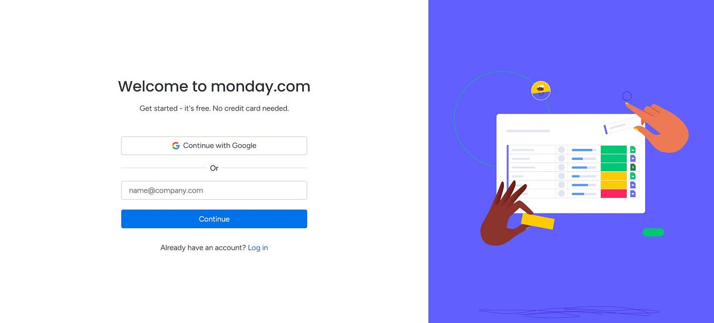

# Meeting Management App - UI/UX Resource

UI/UX design resources for a comprehensive meeting management application that enables users to schedule, join, and manage virtual meetings with an intuitive interface.

## 📱 App Concept Overview

### 1. **User Authentication & Onboarding**
The app features a clean and modern sign-in/sign-up flow that provides users with seamless access to the meeting platform. The authentication system ensures secure user management while maintaining a user-friendly experience for both new and returning users.

### 2. **Meeting Management & Details**
Users can view comprehensive meeting details including participant information, meeting schedules, and administrative controls. The interface provides easy access to meeting settings, participant management, and real-time meeting status updates through an organized and visually appealing layout.

### 3. **Interactive Communication Features**
The app includes a robust chat system that enables real-time communication during meetings. Participants can engage through text messaging, share ideas, and collaborate effectively while maintaining focus on the meeting objectives through a distraction-free chat interface.

## 🎨 Design Assets

This resource pack includes the following UI/UX components:

- **Authentication Flow**: Sign-in and sign-up interface designs
- **Meeting Dashboard**: Comprehensive meeting detail views and dialogs
- **Chat System**: Real-time messaging interface for meeting participants
- **Additional Screenshots**: Supporting UI elements and interactions

## 💡 Implementation Notes

These designs showcase a modern, clean approach to meeting management applications with focus on:
- **User Experience**: Intuitive navigation and clear information hierarchy
- **Visual Design**: Professional appearance suitable for business environments
- **Functionality**: Comprehensive features for complete meeting management workflow

---

*This README provides an overview of the UI/UX concepts demonstrated in the included design assets. Use these resources as inspiration or reference for developing similar meeting management applications.*